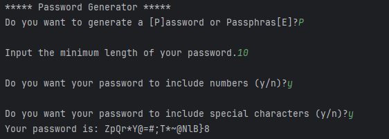
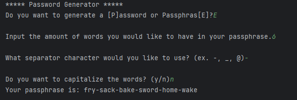

# Password Generator
Password Generator is a simple Python program (strictly Windows) that can be used to generate random passwords (and passphrases). Since I made a password cracker the other day, I figured I should make something that actually
helps the public.
### 
### 

## How do I use it?
Download and unzip the 'password_generator.zip'. Once the prompt opens, you can choose to generate a password or passphrase. It'll ask you if you want to capitalize words, add numbers, include special characters, etc. After going through all those questions, it'll generate a password/phrase for you. You can copy and paste it, then exit the prompt by clicking 'Enter'.
